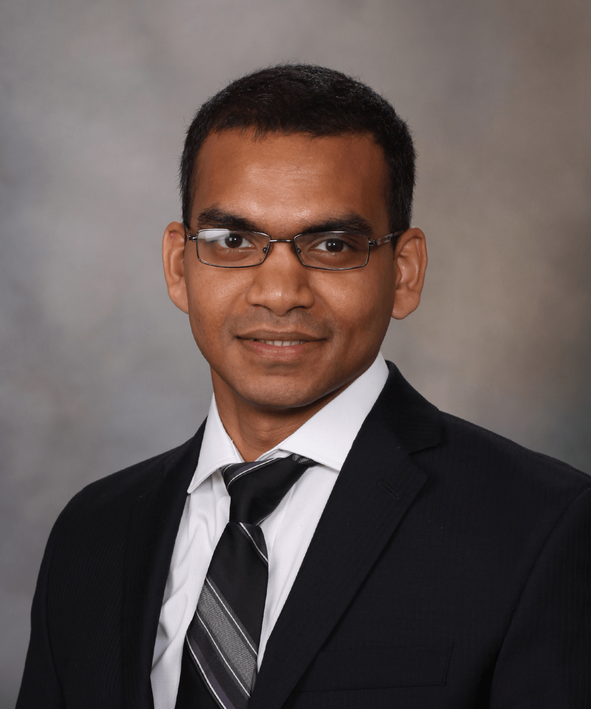

# Devashish Das

  

I am a Research Associate in the [Mayo Clinic Robert D. and Patricia E. Kern Center for the Science of Health Care Delivery](www.mayo.edu). I did my PhD from the Department of Industrial and Systems Engineering at the University of Wisconsin - Madison. Go Badgers! At Madison, I worked with Professor Shiyu Zhou. Check my previous [lab page](http://mpac.engr.wisc.edu/http://mpac.engr.wisc.edu/)!

Prior to that I did my undergrad in Indian Institute of Technology - Kharagpur and I am a proud KGPian for life!

## <i class="fa fa-cog fa-spin fa-3x fa-fw" style="font-size:1em;"></i>  Experience
* Research Associate, 2015 -- now, Mayo Clinic, Rochester, Minnesota
* Research Assistant and Teaching Assistant, 2010 -- 2015,  University of Wisconsin - Madison

## <i class="fa fa-university" style="font-size:1em;"></i> Education

* Ph.D., Industrial Engineering, 2015, University of Wisconsin - Madison
* B. Tech (Hons.), Manufacturing Science and Engineering, 2010, Indian Institute of Technology - Kharagpur.

## <i class="fa fa-address-book" style="font-size:1em;"></i> Contact

* <i class="fa fa-envelope-open" style="font-size:1em;"></i> <a href="mailto:ddas.wisc@gmail.com" target="_top">ddas.wisc@gmail.com</a>
* <i class="fa fa-phone" style="font-size:1em;"></i> +1 507 293 7023